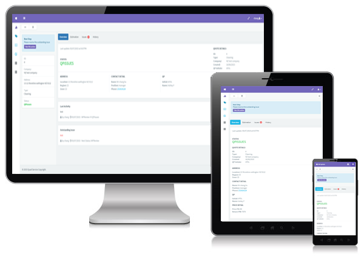

:warning: Demo Only
---

# Description

1. Single Page Application (SPA) based on AngularJS and Bootstrap.
2. Restful API based on ASP.NET WEB API 2, Entity Framework 6, Repository pattern and Owin OAuth.
3. Fully responsive interface and compatible with all different devices. 
4. Implement Authentication with Microsoft Active Directory and AngularJS Routing.
5. AngularJS unit test with Jasmine and Karma.
6. Backend Unit testing with Moq and MSTest.

Database are not included. Demo Only!

## Build & development

1.	Install NodeJS https://nodejs.org/
2.	Install bower from http://bower.io/
3.	Open cmd or git bash and go to the folder BDWorkbook/BDWorkbook
4.	Type : bower install

## Testing

Running `grunt test` will run the unit tests with karma.

